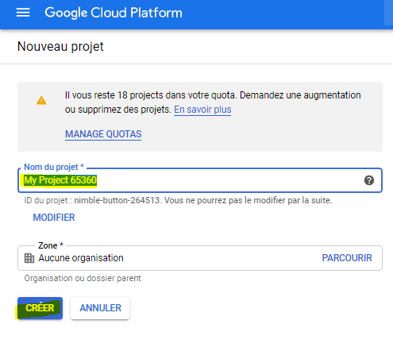
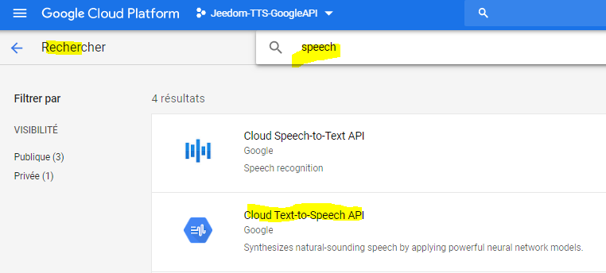
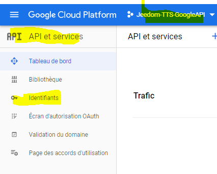
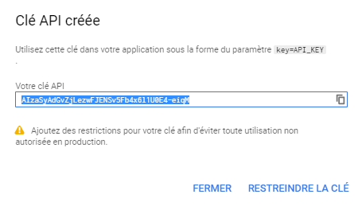

## Clé API Google Cloud Text-to-Speech

> **Note sur la tarification de l'API 'Google Cloud Text-to-Speech'**  
> L'utilisation est gratuite jusqu'à un certain quota d'utilisation qui est largement suffisant pour une utilisation domotique d'un particulier.
> - Voix standards (hors WaveNet): Gratuit de 0 à 4 millions de caractères par mois (puis 4 USD/1 million de caractères supplémentaires)
> - Voix WaveNet: gratuit de 0 à 1 million de caractères par mois (puis 16 USD/1 million de caractères supplémentaires)

#### Créez un projet sur la console Google

– Rendez vous à cette adresse https://cloud.google.com/console
– Cliquez sur *Nouveau Projet* pour créer un nouveau projet.

Donner un nom au projet puis cliquer 'Créer'

#### Activation de "Cloud Text-to-Speech API"

– Rendez vous dans onglet > APIs et services > Bibliothèque
– Dans Browse API taper "Speech" et identifier puis selectionner le service appelé *Cloud Text-to-Speech API*

– Une fois sur la page de l'API, cliquer sur 'Activer'

#### Création d'une clef "Cloud Text-to-Speech API"

- Aller dans le menu *'API et services' > Identifiants* du projet nouvellement crée

- Selectionner le Clé API dans le type d'identifiant à créer

- Récupérer la clé API via copier/coller

