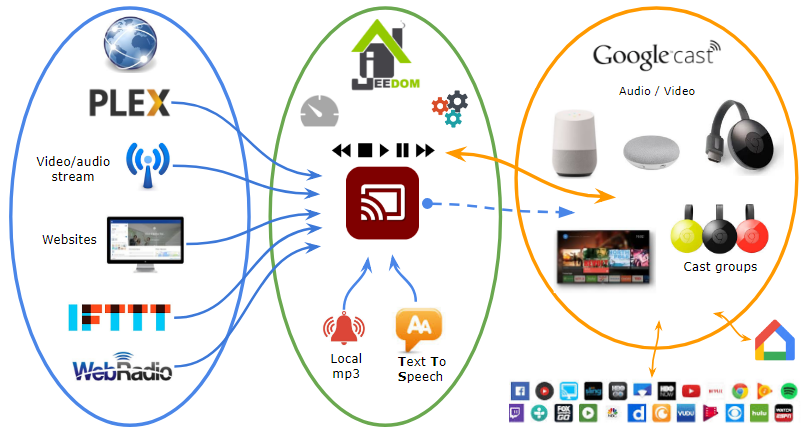
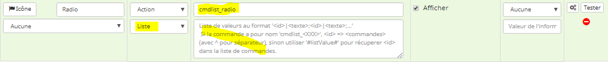

Plugin GoogleCast (googlecast)
=============================


Plugin pour commander les équipements compatibles Google Cast et Google Assistant.


**Fonctionnalités :**

- Contrôle du son (mute, +/-)
- Contrôle des médias (play/pause/stop...)
- Arrêt appli en cours
- Diffuser une page web sur un écran
- Lecture de fichiers audio et vidéo via url
- Retour d'état sur les principales fonctionnalités
- Affichage de la lecture en cours
- Text To Speech (TTS)
- Pour les équipements 'Google Assistant' (ex: Google Home)
    - DoNotDisturb (on/off)
    - recupération/configuration d'autres paramètres


**Modèles compatibles Google Cast**
- Chromecast Audio/Video
- Google Home (ou compatible Google Assistant)
- Android TV, Nexus Player, TV (Vizio, Sharp, Sony, Toshiba, Philips)
- Soundbars and speakers (Vizio, Sony, LG, Philips
B&O Play, Grundig, Polk Audio, Bang & Olufsen, Onkyo, Pioneer...)
- Autres modèles labelisés *Google Cast*
- Certaines Box internet (ex: Bouygues)


**Autres liens**
- Wikipedia <a target="_blank" href="https://en.wikipedia.org/wiki/Google_Cast">GoogleCast</a>
- <a target="_blank" href="https://en.wikipedia.org/wiki/List_of_apps_with_Google_Cast_support">Applications</a> pouvant diffuser sur un équipement GoogleCast

**A quoi ça sert ?**



Dashboard
=======================


Quick Start
=======================

Le plugin est normalement fonctionnel dès l'installation avec le paramétrage par défaut.

En quelques étapes :
1. Installer le plugin du market, les dépendances puis démarrer le démon,
2. Lancer un scan des Google Cast disponibles sur le réseau,
3. Sauvegarder les équipements trouvés,
4. Aller sur le dashboard et tester les boutons 'démo' (media, web...),
5. Pour changer/adapter le paramétrage, lire le reste de la documentation.

Table des matières
=======================

- [Plugin GoogleCast (googlecast)](#plugin-googlecast--googlecast-)
- [Dashboard](#dashboard)
- [Quick Start](#quick-start)
- [Table des matières](#toble-des-matieres)
- [Configuration du plugin](#configuration-du-plugin)
- [Configuration des équipements](#configuration-des--quipements)
    + [Onglet Commandes](#onglet-commandes)
    + [Afficheur Lecture en cours (widget)](#afficheur-lecture-en-cours--widget-)
    + [Widget TTS pour saisie de texte et control du volume](#widget-tts-pour-saisie-de-texte-et-control-du-volume)
- [Commandes personnalisées](#commandes-personnalis-es)
    + [Applications spéciales](#applications-sp-ciales)
    + [Commandes avancées](#commandes-avanc-es)
      - [Syntaxe des commandes brutes](#syntaxe-des-commandes-brutes)
      - [Paramètres possibles pour *play_media* en mode *media* :](#param-tres-possibles-pour--play-media--en-mode--media---)
      - [Paramètres possibles pour *load_url* en mode *web* :](#param-tres-possibles-pour--load-url--en-mode--web---)
      - [Paramètres possibles pour *play_media* en mode *plex* :](#param-tres-possibles-pour--play-media--en-mode--plex---)
      - [Paramètres possibles pour cmd *tts* :](#param-tres-possibles-pour-cmd--tts---)
      - [Paramètres possibles pour cmd *notif* :](#param-tres-possibles-pour-cmd--notif---)
      - [Séquence de commandes](#s-quence-de-commandes)
    + [Configuration des fonctionnalités Google Home/Assistant](#configuration-des-fonctionnalit-s-google-home-assistant)
      - [Récupérer une configuration](#r-cup-rer-une-configuration)
        * [paramètres possibles pour cmd *getconfig* :](#param-tres-possibles-pour-cmd--getconfig---)
      - [Modifier une configuration](#modifier-une-configuration)
        *[paramètres possibles pour cmd *setconfig* :](#param-tres-possibles-pour-cmd--setconfig---)
      - [Commande configuration pré-définies](#commande-configuration-pr--d-finies)
    + [Création dune commande *action* de type *Liste*](#cr-ation-dune-commande--action--de-type--liste-)
    + [Création d'une commande *action* pour un webradio pré-enregistrées](#cr-ation-d-une-commande--action--pour-un-webradio-pr--enregistr-es)
    + [Utilisation dans un scénario](#utilisation-dans-un-sc-nario)
      - [Avec commande dédiée *Custom Cmd*](#avec-commande-d-di-e--custom-cmd-)
      - [Avec bloc code php](#avec-bloc-code-php)
    + [Utilisation avec interactions et IFTTT](#utilisation-avec-interactions-et-ifttt)
      - [Interactions](#interactions)
      - [Réponse type ask](#r-ponse-type--ask-)
      - [Custom CMD](#custom-cmd)
- [Limitations et bug connus](#limitations-et-bugs-connus)
- [FAQ](#faq)
- [Changelog](#changelog)

Configuration du plugin
=======================

Après téléchargement du plugin :
- Activer le plugin
- Lancer l'installation des dépendances
- Niveau de log recommandé : info
- Lancer le démon.

Les paramètres de configuration n'ont généralement pas besoin d'être modifiés
- **Démon**
  - Port du socket interne de communication. Ne modifier que si nécessaire (ex: s'il est déjà pris par un autres plugin)
  - Configuration spéciale (eg: Docker, VM). Ne modifier que si ça ne fonctionne pas sans l'option.
  - Fréquence de rafraîchissement. A ne modifier uniquement si la fréquence normale a un impact important sur les performances globales
- **TTS**
  - Utiliser l'adresse Jeedom externe : par défaut utilise l'adresse web Jeedom interne. Ne modifier que pour des configurations spéciales.
  - Langue par défaut : langue du moteur TTS utilisé par défaut
  - Moteur par défaut : le moteur TTS utilisé (TTS Jeedom, TTS Webserver, PicoTTS, Google Translate, Google Cloud Text-to-Speech)
  - Key Google Cloud Text-to-Speech (uniquement si le moteur 'Google Cloud Text-to-Speech' est selectionné) : Clé API nécessaire à l'utilisation de ce moteur.
  - Voix par défaut pour Google Cloud Text-to-Speech (uniquement si le moteur 'Google Cloud Text-to-Speech' est selectionné) : voix par défaut qui sera utilisé par ce moteur TTS.
  - Vitesse de parole : rapidité de prononciation du texte
  - Ne pas utiliser le cache : désactive l'utilisation du cache Jeedom (déconseillé)
  - Nettoyer cache : nettoie le répertoire temporaire de géneration des fichiers son
  - Suppression automatique du cache de plus de X jours : supprime les fichiers son TTS non utilisés depuis X jours (tâche lancée tous les jours). 0 supprime tout le cache.
- **Notifications**
  - Désactiver notifs pour nouveaux Google Cast : ce sont des notifications lors de la découverte de nouveaux Google Cast non configurés

> **Notes pour TTS (Text To Speech)**  
> - Jeedom TTS est le moteur TTS utilisé par Jeedom. Cela rend compatible l'utilisation du plugin officiel 'Song'. Il ne nécessite pas de connexion internet.
> - TTSWebserveur nécessite l'installation et configuration d'un autre plugin dédié ('TTS Web Server' - payant).
> - PicoTTS ne nécessite pas de connexion internet, l'API Google Translate nécessite un accès web et le rendu est meilleur.
> - Un mécanisme de cache permet de ne générer le rendu sonore que s'il n'existe pas déjà en mémoire (RAM). La cache est donc supprimé au redémarrage du serveur.
> - En cas d'échec sur un des moteurs autre que picotts (ex: problème de connexion internet), la commande sera lancée via picotts.

> **Notes sur le moteur 'Google Cloud Text-to-Speech'**  
> - C'est le moteur TTS de Google (https://cloud.google.com/text-to-speech). Il est entre autres utilisé par la voix de Google Assistant. La qualité est bien supréieure aux autres moteurs TTS.
> - Une clé API est nécessaire qu'il faut avoir créé au préalable (voir [créer un clé API](gcloudttskey.md)).
> - Il est possible de tester les voix sur la page principale https://cloud.google.com/text-to-speech
> - L'utilisation est gratuite jusqu'à un certain quota d'utilisation qui est largement suffisant pour une utilisation domotique d'un particulier.
      + Voix standards (hors WaveNet): Gratuit de 0 à 4 millions de caractères par mois (puis 4 USD/1 million de caractères supplémentaires)
      + Voix WaveNet: gratuit de 0 à 1 million de caractères par mois (puis 16 USD/1 million de caractères supplémentaires)


Configuration des équipements
=============================

La configuration des équipements Google Cast est accessible à partir du menu *Plugins > Multimedia > Google Cast*.


Une fois les équipements branchés, lancer un scan pour les détecter et les ajouter automatiquement. Si aucun équipement apparait, bien vérifier que les équipements sont accessibles et alimentés.

La vue 'Santé'' permet d'avoir une vue synthétique des équipements et de leurs états.

> **Note**    
> Il n'est pas possible d'ajouter manuellement un Google Cast

### Onglet Commandes

Les commandes de bases sont générées automatiquement.

Vous pouvez également ajouter de nouvelles commandes (voir section ci-dessous).


Liste des commandes non visibles par défaut :
- *Statut Player* : info affichant l'état de lecture Média (ex: PLAYING/PAUSED) ;
- *Titre* : Titre du média en cours ;
- *Artist* : Artist du média en cours ;
- *Custom Cmd* : Ce composant est destiné à être utilisé via un scénario ou pour test (voir section [Utilisation dans un scénario](#utilisation-dans-un-scénario));
- *Pincode* : pincode pour association rapide (exemple de configuration avancée)

Pour les voir sur le dashboard, il faut activer 'Afficher' dans l'onglet des commandes.

> **Notes sur commande info 'Statut' (*status_text*)**
> - *status_text* renvoie le statut en cours du Google Cast.    
> - En cas d'erreur au lancement d'une commande, *status_text* est à
> 'CMD UNKNOWN' si la commande n'existe pas,
> 'NOT CONNECTED' si offline ou
> 'ERROR' pour les autres erreurs
> - Au repos (pas d'action en cours), *status_text* = `&nbsp;`


### Afficheur Lecture en cours (widget)

La commande de type information appelée 'Playing Widget' (visible par défaut) permet d'afficher l'image de la lecture en cours.

L'afficheur se rafraichit toutes les 20 secondes par défaut.


Installation / configuration :
- Affiché par défaut après installation. Désactiver l'affichage pour cacher.
- Pour une utilisation dans un dashboard, iL est possible d'utiliser un virtuel en créant une commande de type *info / autres* avec pour valeur la commande *Playing Widget* (non interne *nowplaying*) du Google Cast. Appliquer alors le widget dashboard *googlecast_playing* (via onglet *Affichage* de la configuration avancée de la commande)
- Pour une utilisation dans un design, ajouter la commande *Playing Widget* directement dans le design.

paramètres CSS optionnels (via '*Paramètres optionnels widget*'):
- *fontSize* (ex: 35px, défaut=25px) : taille de police de base
- *fontColor* (ex: blue, défaut=white) : couleur de l'afficheur
- *fontFamily* (ex: 'Arial') : change la police de l'afficheur
- *backColor* (ex: blue, défaut=black) : couleur du fond de l'afficheur
- *playingSize* (ex: 300px, défaut 250px) : largeur et hauteur de l'image de lecture en cours
- *contentSize* (ex: 70px,défaut 50px) : hauteur de la partie textuelle
- *additionalCss* (format css, ex: '.blabla {...}') : pour ajouter/modifier d'autres CSS (utilisateur avancé)


> **Notes**   
> Non disponible pour mobile pour le moment

### Widget TTS pour saisie de texte et control du volume

Un widget est disponible pour les commandes de type action et sous-type message pour permettre de saisir du texte pour le TTS et régler le volume.


Installation / configuration :
- Un exemple est affiché par défaut après installation pour tester la fonction TTS.
- Pour une utilisation dans un dashboard, iL est possible d'utiliser un virtuel en créant une commande de type *action / message* avec pour valeur la commande *Custom Cmd* du Google Cast. Appliquer alors le widget dashboard *googlecast_speak* (via onglet *Affichage* de la configuration avancée de la commande)
- Le contenu de la commande action (sous-type message) peut contenir les variables *#message#* et *#volume#*

paramètres CSS optionnels (via '*Paramètres optionnels widget*'):
- *width* (ex: 35px, défaut=150px) : taille du widget
- *default_volume* (ex: blue, défaut=100) : volume par défaut
- *default_message* (ex: 'Test') : texte par défaut dans le widget
- *additionalCss* (format css, ex: '.blabla {...}') : pour ajouter/modifier d'autres CSS (utilisateur avancé)

> **Notes**   
> Non disponible pour mobile pour le moment


Commandes personnalisées
=============================

### Applications spéciales

- *Web* : afficher une page web sur un Google Cast. Les paramètres disponibles sont l'url, forcer, et le délai de rechargement (ex: value='https://google.com',False,0 pour charger Google sans forcer (nécessaire pour certains sites) et sans rechargement)
- *Media* : lire un fichier audio ou vidéo à partir d'une URL
- *YouTube* : afficher une vidéo à partir d'un ID de vidéo (en fin d'url) => Ne fonctionne pas pour le moment
- *Backdrop* : afficher le fond d'écran ou économiseur d'écran Google Cast (selon les modèles)
- *Plex* : jouer un fichier ou une playlist à partir d'un serveur Plex

> **Notes**   
> - Voir les boutons créés par défaut pour un exemple d'utilisation    
> - Youtube est non fonctionnel pour le moment


### Commandes avancées

#### Syntaxe des commandes brutes
Elles doivent être séparées par *|*
```
- app : name of application (web/backdrop/youtube/media)
- cmd : name of command (depend of application)
    * tts : text to speech, use value to pass text
    * notif : send sound notification based on existing media file (ex: mp3)
    * warmupnotif : prepare device before receiving 'tts' or 'notif' commands (useful for group broadcast)
    * resume : force a resume of previous command (compatible with storecmd, notif and tts)
    * refresh
    * reboot : reboot the googlecast device (doesn't work since end of 2019)
    * volume_up
    * volume_down
    * volume_set : use value (0-100)
    * mute_on
    * mute_off
    * quit_app
    * start_app : use value to pass app id
    * turn_on : try to turn on device by opening basic app (may turn on device for some model)
    * turn_off : equivalent to quit_app (may turn off device for some model)
    * play
    * stop
    * rewind : go back to begining of the current media
    * previous : got to previous media in playlist (if any)
    * skip : got to next media in playlist (if any)
    * next : same as skip
    * seek : use value in seconds. Can use +/- to use relative seek (ex: +20 to pass 20 seconds)
    * pause
    For application dependant commands
        * web : load_url (default)
        * media : play_media (default)
        * youtube : play_video (default)/add_to_queue/remove_video/play_next
        * backdrop : no command
        * plex : play_media  (default)/play/stop/pause
        * spotify : play_media (default) - Experimental
- value : chain of parameters separated by ',' (depending of command)
- vol (optional, between 1 et 100) : adjust volume for the command
- sleep (optional, int/float) : add a break after end of command in seconds (eg: 2, 2.5)
- sleepbefore (optional, int/float) : add a break before command execution in seconds (eg: 2, 2.5)
- uuid (optional) : redirect to other google cast uuid in new thread (parallel processing). Useful when using sequences on several device.
- nothread (optional) : if uuid provided, disable use of thread for parallel processing. (eg: nothread=1)
- brodcast (optional) : 'all' to broadcast to all connected devices (except group cast) or <uuid> seperated by ',' (ex: 'uuid1,uuid2')
- storecmd (optional, 1): just store a command for later resume (compatible with notif, tts and resume)

ex web : app=web|cmd=load_url|vol=90|value='http://pictoplasma.sound-creatures.com',True,10
ex TTS : cmd=tts|vol=100|value=Mon text a dire
ex broadcast : cmd=quit_app|broadcast=all

ex storecmd and resume : app=web|cmd=load_url|vol=90|value='http://pictoplasma.sound-creatures.com'|storecmd=1$$cmd=sleep|value=10$$cmd=resume
```

> **Notes**     
> les chaînes de caractères pour les commandes sont limitées dans Jeedom à 128 caractères. Utiliser les scénarios (voir plus bas pour passer outre cette limitation) ou voir la FAQ pour optimiser la commande.

#### Paramètres possibles pour *play_media* en mode *media* :
```
- value: str - seperated by ',' (see notes)
    * url: str - url of the media (mandatory).
    * content_type: str - mime type. Example: 'video/mp4' (optional).
       Possible values: 'audio/aac', 'audio/mpeg', 'audio/ogg', 'audio/wav', 'image/bmp',
       'image/gif', 'image/jpeg', 'image/png', 'image/webp','video/mp4', 'video/webm'.
    * title: str - title of the media (optional).
    * thumb: str - thumbnail image url (optional, default=None).
    * current_time: float - seconds from the beginning of the media to start playback (optional, default=0).
    * autoplay: bool - whether the media will automatically play (optional, default=True).
    * stream_type: str - describes the type of media artifact as one of the following: "NONE", "BUFFERED", "LIVE" (optional, default='BUFFERED').
    * subtitles: str - url of subtitle file to be shown on chromecast (optional, default=None).
    * subtitles_lang: str - language for subtitles (optional, default='en-US').
    * subtitles_mime: str - mimetype of subtitles (optional, default='text/vtt').
       Possible values: 'application/xml+ttml', 'text/vtt'.
    * subtitle_id: int - id of subtitle to be loaded (optional, default=1).
- live: 1 (optional) - To be specified if this is a live stream such as online radio.

ex short : app=media|cmd=play_media|value='http://contentlink','video/mp4','Video name'
ex short : app=media|cmd=play_media|value='http://contentlink',title:'Video name'
ex short : app=media|value='http://contentlink','video/mp4','Video name' (implicit play_media command call)
ex live stream : app=media|value='http://liveradiostream','audio/mpeg','Video name'|live=1

ex long : app=media|cmd=play_media|value='http://contentlink','video/mp4',title:'Video name',
   thumb:'http://imagelink',autoplay:True,
   subtitles:'http://subtitlelink',subtitles_lang:'fr-FR',
   subtitles_mime:'text/vtt'
```

> **Notes**   
> - Les url et chaînes de caractères sont entourées de guillemets simples ('). Les autres valeurs possibles sont True/False/None ainsi que des valeurs numériques entières.
> - Il est nécessaire de remplacer le signe '=' dans les url par '%3D'
> - Un média local situé dans le répertoire *<jeedom>/plugins/googlecast/localmedia/* peut être utilisé en appelant l'url *local://<nomdufichier>* (ex: local://bigben1.mp3)

#### Paramètres possibles pour *load_url* en mode *web* :
```
- value: str - seperated by ',' (see notes)
    * url: str - website url. Must start with http, https...
    * force: bool - force mode. To be used if default is not working. (optional, default False).
    * reload: int - reload time in seconds. 0 = no reload. (optional, default 0)

ex 1 : app=web|cmd=load_url|value='http://pictoplasma.sound-creatures.com',True,10
ex 2 : app=web|cmd=load_url|value='http://mywebsite/index.php?apikey%3Dmyapikey'
ex 3 : app=web|value='http://mywebsite/index.php?apikey%3Dmyapikey' (implicit load_url command call)
```

> **Notes**   
> - Les url et chaînes de caractères sont entourées de guillemets simples ('). Les autres valeurs possibles sont True/False/None ainsi que des valeurs numériques entières.
> - Il est nécessaire de remplacer le signe '=' dans les url par '%3D'
> - Pour la diffusion de flux caméra, la caméra doit pouvoir fournir le flux via http (rtsp n'est pas compatible google cast)

#### Paramètres possibles pour *play_media* en mode *plex* :
```
- value: str - search query. It could be individual title, playlist or other type of content handled by Plex (it will play the first element returned).
- type: str - type of content. Example: 'video/audio' (optional, default=video).
- server: str - URL if token is provided, friendly name of Plex server if user & pass provided.
- user: str - account login possibly as an email account (optional if token provided).
- pass: str - account password (optional if token provided).
- token: str - token if any (optional if user & pass provided).
- shuffle: 0/1 - shuffle playlist if several media (optional, default=0).
- repeat: 0/1 - repeat media (optional, default=0).
- offset: int - media offset (optional, default=0).

ex using user & pass :   
   app=plex|cmd=play_media|user=XXXXXX|pass=XXXXXXXXXXX|server=MyPlexServer|value=Playlist Jeedom|shuffle=1|type=audio
ex using token :   
   app=plex|cmd=play_media|token=XXXXXXXXX|server=http://IP:32400|value=Playlist Jeedom
ex using token with implicit play_media command call :   
   app=plex|token=XXXXXXXXX|server=http://IP:32400|value=Playlist Jeedom
```

> **Notes**   
> - When using user & pass, internet access is required
> - Token value is displayed in logs (debug) when user & pass has been used the first time. Token is then persistent.
> - you can simulate result of search query (value) in main search field of Plex web UI


#### Paramètres possibles pour *play_media* en mode *spotify* (experimental) :

!! Le plus dur est de récupérer un token valable !!    
Pas de support sur cette fonctionnalité

```
- value: str - media id. Format : 'track:<id>', 'album:<id>', 'playlist:<id>'.
- token: str - token (required).

ex using valid token :   
   app=spotify|token=XXXXXX|value=track:3Zwu2K0Qa5sT6teCCHPShP
```

> **Notes**   
> - Token is too long to be passed through regular command. Use *CustomCmd*.
> - For test, you can use a web token (open spotify in browser, log in and look for 'wp_access_token' value to use as token).

#### Paramètres possibles pour cmd *tts* :
```
- value: str - text
- lang: str - fr-FR/en-US or any compatible language (optional, default is configuration)
- engine: str - jeedomtts/ttsws/picotts/gtts/gttsapi. (optional, default is configuration)
- quit: 0/1 - quit app after tts action.
- forcetts: 1 - do not use cache (useful for testing).
- speed: float (default=1.2) - speed of speech (eg: 0.5, 2).
- vol: int (default=previous) - set the volume for the time TTS message is broadcast. Previous volume is resumed when done.
- sleep: float (default=0) - add time in seconds after tts is finished (before volume resume)
- silence: int (default=300, 600 for group cast) - add a short silence before the speech to make sure all is audible (in milliseconds)
- generateonly: 1 - only generate speech file in cache (no action on device)
- forcevol: 1 - Set volume also if the current volume is the same (useful for TTS synchronisation in multithreading)
- noresume: 1 - disable recovery of previous state before playing TTS.
- forceapplaunch: 1 - will try to force launch of previous application even if not launched by plugin.
- highquality: 1 - increase tts sound file bitrate and sample rate. Use this setting for test as it should not improve much audio quality.
- buffered: 1 - stream to google cast as buffered stream instead of live. Use this setting for test.
- voice (gttsapi only): overwrite default voice (eg: 'fr-FR-Standard-A')
- usessml (gttsapi only): 1 - use ssml format insteaf of text in 'value' field. See https://cloud.google.com/text-to-speech/docs/ssml ('=' symbols must be replace by '^')
- pitch (gttsapi only): 0 - speaking pitch, in the range [-20.0, 20.0]. 20 means increase 20 semitones from the original pitch. -20 means decrease 20 semitones from the original pitch.
- volgain (gttsapi only): 0 - volume gain (in dB) of the normal native volume supported by the specific voice, in the range [-96.0, 16.0].

ex : cmd=tts|value=My text|lang=en-US|engine=gtts|quit=1
ex : cmd=tts|value=Mon texte|engine=gtts|speed=0.8|forcetts=1
ex voice/ssml : cmd=tts|engine=gttsapi|voice=fr-CA-Standard-A|value=<speak>Etape 1<break time^"3s"/>Etape 2</speak>
```

> **Notes**   
> - By default, the plugin will try to resume previous app launched (will only work when previous application has been launched by the plugin).
> - You can try to force resume to any application using 'forceapplaunch=1' but there is a good chance that it will not resume correctly.

#### Paramètres possibles pour cmd *notif* :
```
- value: str - local media filename (located in '<jeedom>/plugins/googlecast/localmedia/' folder)
- quit: 0/1 - quit app after notif action.
- vol: int (default=previous) - set the volume for the time notif message is broadcast. Previous volume is resumed when done.
- duration: float (default=file duration) - override play duration of notification.
- sleep: float (default=0) - add time in seconds after notif is finished (before volume resume)
- forcevol: 1 - Set volume also if the current volume is the same (useful for notif synchronisation in multithreading)
- noresume: 1 - disable recovery of previous state before playing notif.
- forceapplaunch: 1 - will try to force launch of previous application even if not launched by plugin.

ex : cmd=notif|value=bigben1.mp3|vol=100
ex : cmd=notif|value=tornado_siren.mp3|vol=100|duration=11
```

> **Notes**  
> - By default, the plugin will try to resume previous app launched (will only work when previous application has been launched by the plugin).
> - You can try to force resume to any application using 'forceapplaunch=1' but there is a good chance of failure.
> - Existing sounds in plugin : house_firealarm.mp3, railroad_crossing_bell.mp3, submarine_diving.mp3, tornado_siren.mp3, bigben1.mp3, bigben2.mp3
> - files added to localmedia folder must have approriate rights

#### Séquence de commandes
Il est possible de lancer plusieurs commandes à la suite en séparant par *$$*

```
ex 1 : cmd=tts|sleep=2|value=Je lance ma vidéo$$app=media|cmd=play_video|value='http://contentlink','video/mp4','Video name'
ex 2 : app=media|cmd=play_video|value='http://contentlink','video/mp4','Video name',current_time:148|sleep=10$$cmd=quit_app
ex Commande TTS sur plusieurs google cast en parallèle en s'assurant que le fichier est déjà en cache :   
    cmd=tts|value=My TTS message|generateonly=1$$uuid=XXXXXXXXXXX|cmd=tts|value=My TTS message$$uuid=YYYYYYYYYYY|cmd=tts|value=My TTS message
```
> **Note**   
> adding 'uuid' parameter will redirect to this uuid device in new thread. This can be used to send a sequence to several device in one command.

### Configuration des fonctionnalités Google Home/Assistant

Cela permet de récupérer (ou modifier) des informations tel que les alarmes, timers, configuration bluetooth...

> **Important**   
> Depuis mi 2019, un jeton d'authorisation est nécessaire afin de pouvoir récupérer ou modifier la plupart de ces configurations.   

La procédure de récupération des jetons est ici : https://gist.github.com/rithvikvibhu/1a0f4937af957ef6a78453e3be482c1f#the-token

Ce jeton doit être saisi sur la page de configuration de chaque Gooogle Home.

#### Récupérer une configuration
Certaines configurations peuvent être récupérées dans une commande de type info (*cmd=getconfig*).

Ces commandes de ce type sont rafraichies toutes les 15 minutes ou manuellement via appel de la commande 'refreshconfig' (non visible par défaut)

La liste non officielles des elements récupérables est disponible sur  https://rithvikvibhu.github.io/GHLocalApi/

> Note   
> Quelques information récupérables sans jetons d'authenficiation sont visibles via l'url de l'équipement : http://IP:8008/setup/eureka_info?options=detail


##### paramètres possibles pour cmd *getconfig* :
```
- value: str - uri base after 'setup/' based on API doc (default is 'eureka_info'). If starts with 'post:', a POST type request will be issued.
- data: str - json path to be returned separated by '/'. To get several data, separate by ','. Alternatively, JsonPath format can be used ( http://goessner.net/articles/JsonPath).
- sep: str - seperator if several data is set (default = ',').
- format: json/string/custom/php - output format (default = 'string'). 'custom' follows 'sprintf' php function format (ex: %d, %s). 'php' return php array.
- error: 1 - will generate error if failing.
- reterror: str - value to be returned if connection fails. Default will not change previous state.
- noupdatecmd: 1 - update command result if exist even if failed.

Exemples:
- Récupération du pincode d'une Google Chromecast :
cmd=getconfig|data=opencast_pin_code
- Google Home : Récupération de l'état de la première alarme (-1 en cas de problème ou non existant) :
cmd=getconfig|value=assistant/alarms|data=$.alarm.[0].status|reterror=-1
- Google Home : Récupération de la date et heure de la première alarme au format JJ-MM-AAAA HH:MM :
cmd=getconfig|value=assistant/alarms|data=$.alarm.[0].fire_time|fnc=ts2long|reterror=00-00-0000 00:00
- Google Home : Récupération de la date et heure de l'alarme avec id connu au format JJ-MM-AAAA HH:MM :
cmd=getconfig|value=assistant/alarms|data=$.alarm.[?(@.id=alarm/xxxxxx)].fire_time|fnc=ts2long|reterror=00-00-0000 00:00
- Changer le nom du Google cast :
cmd=setconfig|data={"name":"Mon nouveau nom"}
- Google Home : Désactiver le mode nuit :
cmd=setconfig|value=assistant/set_night_mode_params|data={"enabled": false}
- Google Home : Changer luminosité du mode nuit :
cmd=setconfig|value=assistant/set_night_mode_params|data={"led_brightness": 0.2}
```

#### Modifier une configuration
Certaines configurations peuvent être modifiées dans une commande de type action (*cmd=setconfig*).

Voir l'api Google sur ce lien pour ce qui est modifiable : https://rithvikvibhu.github.io/GHLocalApi/

##### paramètres possibles pour cmd *setconfig* :
```
- value: str - uri base after 'setup/' based on API doc.
- data: str - json data.

Exemples:
- Disable notification on Google home :
cmd=setconfig|value=assistant/notifications|data={'notifications_enabled': false}
- Google Home : Volume au plus bas pour alarme :
cmd=setconfig|value=assistant/alarms/volume|data={'volume': 1}
```

#### Commande configuration pré-définies

Les commandes suivantes peuvent être utilisées dans une commande 'info' ou scénario (via fonction *getInfoHttpSimple()*) :

- *gh_get_alarms_date* : retourne la date de toutes les alarmes.
- *gh_get_alarms_id* : retourne les identifiants uniques de toutes les alarmes et timers.
- *gh_get_alarm_date_#* (#=numéro, commence par 0) : retourne la date de la prochaine alarme au format dd-mm-yyyy HH:mm.
- *gh_get_alarm_datenice_#* (#=numéro, commence par 0) : retourne la date de la prochaine alarme au format {'Aujourdhui'|'Demain'|dd-mm-yyyy} HH:mm.
- *gh_get_alarm_timestamp_#* (#=numéro, commence par 0) : retourne le timestamp de la prochaine alarme.
- *gh_get_alarm_status_#* (#=numéro, commence par 0) : statut de l'alarme (1 = configuré,  2 = sonne).
- *gh_get_timer_timesec_#* (#=numéro, commence par 0) : retourne le nombre de secondes avant déclenchement du timer.
- *gh_get_timer_time_#* (#=numéro, commence par 0) : retourne la date de déclenchement du timer.
- *gh_get_timer_duration_#* (#=numéro, commence par 0) : retourne la durée originale configurée du timer.
- *gh_get_timer_status_#* (#=numéro, commence par 0) : statut du timer (1 = configuré,  3 = sonne).
- *gh_get_donotdisturb* : retourne l'état de la fonction 'Do Not Disturb'.
- *gh_get_alarms_volume* : récupère le volume des alarmes et timers.
- *conf_pincode* : retourne le code pin d'association.
- *castversion* : retourne le numero de version du firmware googlecast.
- *conf_getbonded_bluetooth* : retourne tous les équipements bluetooth enregistrés.
- *conf_getconnected_wifi* : retourne le nom du réseau wifi configuré.

Les commandes suivantes peuvent être utilisées dans une commande 'action' ou scénario (via fonction *setInfoHttpSimple()* ou commande *Custom Cmd*) :

- *gh_set_donotdisturb_on* : active la fonction 'Do Not Disturb'.
- *gh_set_donotdisturb_off* : désactive la fonction 'Do Not Disturb'.
- *gh_set_donotdisturb_#* (#=true/false) : active/désactive la fonction 'Do Not Disturb'
- *gh_set_alarms_volume_#* (# = entre 0 et 100 (eg: 10)) : configure le volume des alarmes et timers.
- *bt_connectdefault* : connecte l'équipement bluetooth configuré par défaut.
- *bt_connect_X* (#=adresse mac au format xx:xx:xx:xx:xx:xx) : connecte l'équipement bluetooth donné en paramètre.
- *bt_disconnectdefault* : déconnecte l'équipement bluetooth configuré par défaut.

```
Exemples:
- Commande de type info
gh_get_alarm_date_0
- Commande de type action
gh_set_alarms_volume_80
```

### Création dune commande *action* de type *Liste*

Pour créer une commande *action* de type *Liste* dont plusieurs paramètres changent, la commande doit impérativement s'appeler *cmdlist_XXXX* avec XXXX pouvant être remplacé par un nom (example cmdlist_radio).

Le champs *Liste de valeurs* doit contenir la liste de commandes entière et suivre le format `<commandes>|<texte affiché>;<commandes>|<texte affiché>;...`   
Le séparateur de commande devra être changé de '|' pour '^'.

````
Exemple site web :
app=web^cmd=load_url^value='https://google.com'|Google;
app=web^cmd=load_url^value='https://facebook.com'|Facebook

Exemple pour webradio :
app=media^value='http://urlFluxRadio1/flux.mp3','audio/mpeg','Radio 1'|Radio 1;
app=media^value='http://urlFluxRadio2/flux.mp3','audio/mpeg','Radio 2'|Radio 2;
app=media^value='http://urlFluxRadio3/flux.mp3','audio/mpeg','Radio 3'|Radio 3
````



> **Note**   
> Pour des commandes plus simples (un seul paramètre change), il est toujours possible d'utiliser le placeholder *#listValue#* dans une commande.    
> Exemple : `app=web|cmd=load_url|value=#listValue#` avec comme liste de valeurs `https://google.com|Google;https://facebook.com|Facebook`

### Création d'une commande *action* pour un webradio pré-enregistrées

Pour créer une commande *action* qui lance une webradio pré-enregistrée (avec logo), utiliser les commandes ci-dessous parmis la liste.

radio_africa_n1_paris, radio_bfm_business, radio_cherie_fm, radio_europe_1, radio_fg, radio_fip, radio_fip_jazz, radio_fip_monde, radio_fip_nouveaute, radio_france_bleue, radio_france_culture, radio_france_info, radio_france_inter, radio_france_musique, radio_fun_radio, radio_hotmix-golds, radio_hotmix_2000, radio_hotmix_80, radio_hotmix_90, radio_hotmix_Hits, radio_hotmix_dance, radio_hotmix_frenchy, radio_hotmix_funky, radio_hotmix_game, radio_hotmix_hiphop, radio_hotmix_hot, radio_hotmix_lounge, radio_hotmix_metal, radio_hotmix_new, radio_hotmix_rock, radio_hotmix_sunny, radio_hotmix_vip, radio_jazz, radio_jazz_ladies_crooners, radio_jazz_radio, radio_latina, radio_m_radio, radio_mix_x_fm, radio_mouv, radio_nostalgie, radio_nova, radio_nrj, radio_nrj_uhd, radio_oui_fm, radio_phare_fm, radio_pulsradio_2000, radio_pulsradio_80, radio_pulsradio_90, radio_pulsradio_club, radio_pulsradio_dance, radio_pulsradio_hits, radio_pulsradio_lounge, radio_pulsradio_trance, radio_radio_classique, radio_radio_suisse_classique, radio_rcf, radio_rfi_monde, radio_rfi_monde_hd, radio_rfm, radio_rire_et_chanson, radio_rmc, radio_rtl, radio_rtl2_hd, radio_rtl_2, radio_rtl_hd, radio_skyrock, radio_sud_radio, radio_sweet_fm, radio_tsf_jazz, radio_vibration, radio_virage, radio_virgin_radio, radio_voltage, radio_voltage_lounge, radio_wit_fm

````
Exemple : commande appelée 'radio_rtl'
````

> **Note**   
> Il est possible de rajouter des webradios dans un fichier appelé *custom.json* (à créer) dans le répertoire du plugin *webradios*. Le format doit être similaire au fichier *webradios/radiolist.json* (l'id de la radio devra être concatené avec *radio_* au début pour l'utiliser en commande; eg: id radio *XXXX* devra être appelé avec la commande *radio_XXXX*).
Ce fichier ne sera pas modifié lors des mises à jour du plugin.
A la création du fichier, s'assurer que le fichier à les bons droits avec la commande `sudo chown www-data:www-data custom.json && sudo chmod 775 custom.json`


### Utilisation dans un scénario

#### Avec commande dédiée *Custom Cmd*
La commande nommée *Custom Cmd* permet de lancer une commande brute à partir d'un scénario.

Par exemple, pour lancer Google sur un Google Cast à partir d'un scénario, ajouter la commande avec la valeur souhaitée dans le champs 'message'.
```
app=web|cmd=load_url|value='https://google.com',True,10
```


#### Avec bloc code php

Exemples en utilisant un bloc code php :

```php
$googlecast = googlecast::byLogicalId('XXXXXXXX-XXXX-XXXX-XXXX-XXXXXXXXX', 'googlecast');
if ( !is_object($googlecast) or $googlecast->getIsEnable()==false ) {
  $scenario->setData("_test", "None");
  // variable _test contains 'None' if google cast does not exist or is disable
}
else {
  // Run a command as single command or sequence (seperated by $$) or by sending a php array of commands
  $ret =  $googlecast->helperSendCustomCmd('cmd=tts|value=Test Scénario PHP|vol=100');
  $scenario->setData("_test", $ret);
  // Command launched
  // $ret = true if command has been ran, false if deamon is not running
  // variable _test contains 1 if true, 0 if false

  // Configure a Google Home equipement
  $ret =  $googlecast->setInfoHttpSimple('bt_connect_xx:xx:xx:xx:xx:xx');
  // or $googlecast->helperSendCustomCmd('bt_connect_xx:xx:xx:xx:xx:xx'); (return false if deamon not running, true otherwise)
  // Try to connect a bluetooth device (mac=xx:xx:xx:xx:xx:xx) to Google Home
  // $ret = true if command has been launched, false if failed (Google Home not accessible)

  // Get curent GH alarm time (via long command)
  $ret =  $googlecast->getInfoHttpSimple('cmd=getconfig|value=assistant/alarms|data=$.alarm.[0].fire_time|fnc=ts2long|reterror=Undefined');
  $scenario->setData("_test",$ret);
  // variable _test contains dd-mm-yyyy HH:mm (Undefined if failed)

  // Get curent GH alarm time (via pre-configured command)
  $ret =  $googlecast->getInfoHttpSimple('gh_get_alarm_date_0');
  // or $googlecast->helperSendCustomCmd('gh_get_alarm_date_0'); (return false if deamon not running, true otherwise)
  $scenario->setData("_test",$ret);
  // variable _test contains dd-mm-yyyy HH:mm (Undefined if failed)

 // Get curent GH alarm date only (via long command with formatting)
  $ret =  $googlecast->getInfoHttpSimple('cmd=getconfig|value=assistant/alarms|data=$.alarm.[0].date_pattern|format=%02d%02d%04d|reterror=00000000');
  $scenario->setData("_test",$ret);
  // variable _test contains JJMMAAAA (00000000 if failed)
}
```

Exemple d'attente de fin de commande TTS ou NOTIF :

```php
// -----------------------
// entire code
$uuid = 'XXXXXXXX-XXXX-XXXX-XXXX-XXXXXXXXX';
$maxwait = 30;	// 30 sec of max waiting
$retrydelay = 500*1000;	// will retry every 500 ms
$command_string = 'cmd=tts|value=Test Scénario PHP pour gérer le délai !|vol=100';

$googlecast = googlecast::byLogicalId($uuid, 'googlecast');
if ( !is_object($googlecast) or $googlecast->getIsEnable()==false or $googlecast->isOnline()==false ) {
  	return;
}
else {
  $googlecast->helperSendCustomCmd($command_string);
  sleep(2); // make sure command has started
  $status = $googlecast->getInfoValue('status_text');
  $starttime = time();
  while ($status=='Casting: TTS' or $status=='Casting: NOTIF' ) {
    usleep($retrydelay);    // or sleep(1);	// 1 sec
    $status = $googlecast->getInfoValue('status_text');
    if ( (time()-$starttime)>$maxwait ) {
      break;
    }
  }
  return;
}

// -----------------------
// using helper static method
// params: uuid, command, time in second before failing (default 30), retry delay in ms (default 500), initial delay in seconds (default 2)
// return true if success, false if uuid is wrong, disable, offline or delay has passed.
$ret = googlecast::helperSendNotifandWait_static('XXXXXXXX', 'cmd=tts|value=Test Scénario PHP pour gérer le délai', 30, 500);
// with default values : $ret = googlecast::helperSendNotifandWait_static('XXXXXXXX', 'cmd=tts|value=Test Scénario PHP')

// -----------------------
// or using helper instance method
$googlecast = googlecast::byLogicalId($uuid, 'googlecast');
// params: uuid, command, time in second before failing, retry delay in ms, initial delay in seconds (default 2)
// return true if success, false if disable, offline or delay has passed.
$ret = $googlecast->helperSendNotifandWait('XXXXXXXX', 'cmd=tts|value=Test Scénario PHP pour gérer le délai')
```

### Utilisation avec interactions et IFTTT

Trois types d'actions sont possibles :
- Intéraction TTS (Text To Speech)
- Réponse à action de type ask
- Lancer une commande personnalisée

#### Interactions
Compatibilité avec interaction IFTTT de type *TTS* en utilisant l'url suivante dans la configuration (GET ou POST) :
```
http(s)://#JEEDOM_DNS#/plugins/googlecast/core/php/googlecast.ifttt.php?apikey=#GCASTPLUGIN_APIKEY#&uuid=#GCAST_UUID#&query=<<{{TextField}}>>
Optional :   
  &vol=X (between 1 and 100)    
  &noresume=1 (will not try to resume previous app)    
  &quit=1        
  &silence=X (in milliseconds, ex: 1000 for 1 sec)
```
Documentation Jeedom et IFTTT : https://jeedom.github.io/plugin-gcast

#### Réponse type *ask*
Compatibilité avec IFTTT et réponse à une requête de type *ask* (scénarios) en utilisant l'url suivante dans la configuration (GET ou POST) :
```
# on specific device UUID
http(s)://#JEEDOM_DNS#/plugins/googlecast/core/php/googlecast.ifttt.php?apikey=#GCASTPLUGIN_APIKEY#&uuid=#GCAST_UUID#&action=askreply&query=<<{{TextField}}>>

# on all devices
http(s)://#JEEDOM_DNS#/plugins/googlecast/core/php/googlecast.ifttt.php?apikey=#GCASTPLUGIN_APIKEY#&uuid=any&action=askreply&query=<<{{TextField}}>>
```

> **Notes**   
> - uuid peut avoir la valeur *any* pour tester tous les équipements Google Cast en attente potentielle de réponse.
> - l'action ask du scénario peut utiliser soit la commande *Custom Cmd* (ex: cmd=tts|value="Confirmer commande ?"|vol=60) soit la commande *Parle !*.

#### Custom CMD
Envoyer une commande à partir d'un webhook (GET ou POST)
```
http(s)://#JEEDOM_DNS#/plugins/googlecast/core/php/googlecast.ifttt.php?apikey=#GCASTPLUGIN_APIKEY#&uuid=#GCAST_UUID#&action=customcmd&query=#CUSTOM_CMD#
Notes :   
  #CUSTOM_CMD# : as defined in documentation (eg : app=web|cmd=load_url|value='http://pictoplasma.sound-creatures.com')    
  It may be necessary to encode #CUSTOM_CMD# using https://www.url-encode-decode.com/
```

Limitations et bugs connus
=============================

- Moteur PicoTTS ne gère pas les phrases accentuées (ils sont supprimés)


FAQ
=============================

#### Aucune détection lors du scan

- Vérifier que le Google Cast est disponible à partir d'une application permettant la visualisation des appareils compatibles ;
- Jeedom doit se trouver sur le même réseau que les équipements Google Cast    
(pour Docker, le container doit être configuré pour être sur le même réseau ; en VM, la machine est en mode bridge) ;
- Vérifier qu'il n'y a pas de blocages au niveau du firewall pour la découverte via le protocole 'Zeroconf' ;
- Pour mettre Docker sur le même réseau, voir https://github.com/guirem/plugin-googlecast/issues/8

#### Aucune commande ne semble fonctionner

- Vérifier que le Google Cast fonctionne avec d'autres équipements (appli mobile) ;
- Vérifier que rien n'a changé depuis le scan ;

#### Certaines commandes ne fonctionnent pas

- Cela peut dépendre du modèle et de l'application l'utilisant ;

#### Les dépendances ne s'installent pas

Vérifier dans les logs (*Googlecast_update*) la provenance de l'erreur. Le plugin nécessite l'installation de python3, pip3.

Si le log contient le message *Error: Cound not found pip3 program to install python dependencies !*, tenter de lancer les lignes de commandes en ssh :
- `python3 -V` doit retourner la version de python 3 installée.
- `compgen -ac | grep -E '^pip-?3' | sort -r | head -1` doit retourner une ligne (ex: pip3)
- Si aucun retour sur la ligne précédente, tenter une réinstallation de pip3   
```
sudo python3 -m pip uninstall -y pip
sudo apt-get -y --reinstall install python3-pip
```
- Relancer l'installation des dépendances

#### Les dépendances sont 'ok' mais le démon ne se lance pas

Un des modules est peut etre corrompu.
Pour désinstaller les modules utiliser la commande
```
sudo pip3 uninstall -y requests zeroconf click bs4 six tqdm websocket-client
```
Puis relancer l'installation des dépendances.

#### Le Text To Speech (TTS) ne fonctionne pas

- Essayer avec les paramètres suivants : 'Utiliser l'adresse Jeedom externe' ou 'Ne pas utiliser le cache'
- Si Jeedom n'a pas d'accès web, utiliser le moteur picoTTS
- Vérifier dans les logs la nature de l'erreur

#### Le Text To Speech (TTS) fonctionne mais a des coupures pendant le message ou se termine trop tôt

Le type d'équipements utilisés (wifi, serveur Jeedom) ou la longueur du message peut avoir un impact sur le rendu TTS.
- Ajouter le paramêtre 'sleep' pour ajouter un délai supplémentaire à la fin du message (ex: |sleep=0.8 pour 0.8 seconde).
- Tester avec le paramètre 'buffered=1' pour voir si cela règle le problème.
- Utiliser le paramêtre 'forcetts' durant les tests pour être certain que le cache n'est pas utilisé.

#### Les fichiers nouvellement placés dans le repertoire 'localmedia' ne fonctionnent pas

Les nouveaux fichiers doivent avoir les droits de lecture
A partir du répertoire localmedia, corriger les droits avec la commande :     
`sudo chown www-data:www-data * && sudo chmod 775 *`

#### Diffuser Jeedom sans authentification sur un Google Cast

C'est possible via le mode web. Pour gérer l'authentification automatiquement, utiliser le plugin 'autologin' (voir doc du plugin).    
Note : Les champs de commandes sont limités a 128, voir ci-dessous pour optimiser la longueur de la commande.

#### La commande est tronquée au dela de 128 caractères

C'est une limitation Jeedom. L'alternative est d'utiliser la commande *custom cmd* via un scénario qui n'a pas de limitation.    

Cependant, il est possible d'optimiser la longueur de la commande :
- *value=* peut être réduit en *v=*
- Pour le mode *web* et *media*, *cmd=X* est inutile car implicite (ex: *app=web|cmd=load_url|v=.....* identique à *app=web|v=.....*)
- Les booleans *True*/*False* peuvent être réduits à *T*/*F*
- Enlever le port si 80 ou 443 (http://addresseweb:80/contenu => http://addresseweb/contenu)
- Pour les url, *http://* peut être réduit en *h:/* et *https://* peut être réduit en *hs:/*
- Pour les url longues, utiliser des services web tel que bitly pour les réduire drastiquement

Exemple : *app=web|cmd=load_url|value='https://xxxxx.xxxxxxx.com:443/plugins/autologin/core/php/go.php?apikey%3Dxxxxxxxxxxxxxxxxxxxxxxxxxxxxxxxx&id%3D999',True* réduit en *app=web|v=hs:/xxxxx.xxxxxxx.com/plugins/autologin/core/php/go.php?apikey%3Dxxxxxxxxxxxxxxxxxxxxxxxxxxxxxxxx&id%3D999,T*

#### Récupérer une clé API pour utiliser TTS 'Google Cloud Text-to-Speech'

[Créer un clé API](gcloudttskey.md).

#### La clé API pour utiliser TTS 'Google Cloud Text-to-Speech' ne fonctionne plus

Suite à la mise à jour de janvier 2020, il est probable que l'API 'Google Cloud Text-to-Speech' doivent être activée sur l'interface via Google Cloud. Avant cette mise à jour, une autre API était utilisée.

#### Comment récupérer les alamers et timers d'un Google Home

C'est possible mais il est nécessaire d'avoir un jeton d'authentification (https://gist.github.com/rithvikvibhu/1a0f4937af957ef6a78453e3be482c1f) configuré sur la page du googlecast. Voir la section de la doc dédiée.


Changelog
=============================

[Voir la page dédiée](changelog.md).
