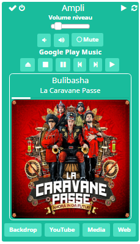
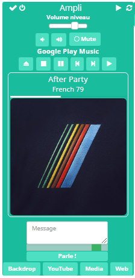
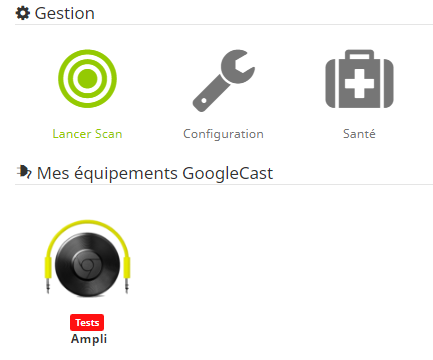
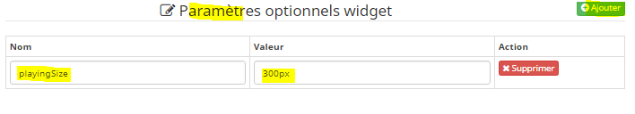
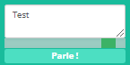

Plugin GoogleCast (googlecast)
=============================


Plugin pour commander les équipements compatibles Google Cast.


**Fonctionnalités :**

- Contrôle du son (mute, +/-)
- Contrôle des médias (play/pause/stop...)
- Arrêt appli en cours, reboot
- Diffuser une page web sur un écran
- Lecture de fichiers audio et vidéo via url
- Retour d'état sur les principales Fonctionnalités
- Affichage de la lecture en cours
- Text To Speech (TTS)
- Récupération/modification de configuration d'équipements


**Modèles compatibles Google Cast**
- Chromecast Audio/Video
- Android TV, Nexus Player, TV (Vizio, Sharp, Sony, Toshiba, Philips)
- Google Home
- Soundbars and speakers (Vizio, Sony, LG, Philips
B&O Play, Grundig, Polk Audio, Bang & Olufsen, Onkyo, Pioneer...)
- Autres modèles labelisés *Google Cast*


**Autres liens**
- Wikipedia <a target="_blank" href="https://en.wikipedia.org/wiki/Google_Cast">GoogleCast</a>
- <a target="_blank" href="https://en.wikipedia.org/wiki/List_of_apps_with_Google_Cast_support">Applications</a> pouvant diffuser sur un équipement GoogleCast


Dashboard
=======================




Configuration du plugin
=======================

Après téléchargement du plugin :
- Activer le plugin
- Lancer l'installation des dépendances
- Niveau de log recommandé : info
- Lancer le démon.

Les paramètres de configuration n'ont généralement pas besoin d'être modifiés
- **Démon**
  - Port du socket interne de communication. Ne modifier que si nécessaire (ex: s'il est déjà pris par un autres plugin)
  - Configuration spéciale (eg: Docker, VM). Ne modifier que si ça ne fonctionne pas sans l'option.
  - Fréquence de rafraîchissement. A ne modifier uniquement si la fréquence normale à un impact important sur les performances globales
- **TTS**
  - Utiliser l'adresse Jeedom externe : par défaut utilise l'addresse web Jeedom interne
  - Langue par défaut : langue du moteur TTS utilisé par défaut
  - Moteur par défaut : le moteur TTS utilisé (PicoTTS, Google Translate, Google Speach API, Google Speach API dev)
  - Vitesse de parole : rapidité de prononciation du texte
  - Ne pas utiliser le cache : désactive l'utilisation du cache Jeedom (déconseillé)
  - Nettoyer cache : nettoie le repertoire temporaire de géneration des fichiers son
  - Suppression automatique du cache de plus de X jours : supprime les fichiers son TTS non utilisés depuis X jours (cron journalier). 0 supprime tout le cache.
- **Notifications**
  - Désactiver notifs pour nouveaux Google Cast : ce sont des notifications lors de la découverte de nouveaux Google Cast non configurés

> **Notes pour TTS (Text To Speech)**  
> - PicoTTS ne nécessite pas de connexion internet, l'API Google Translate nécessite un accès web et le rendu est meilleur.
> - Pour Google Speech API, une clé est nécessaire (voir FAQ). Le rendu est meilleur que Google Translate API.
> - Un mécanisme de cache permet de ne générer le rendu sonore que s'il n'existe pas déjà en mémoire (RAM). La cache est donc supprimé au redémarrage du serveur.
> - En cas d'échec sur un des moteurs autre que picotts (ex: problème de connexion internet), la commande sera lancée via picotts


Configuration des équipements
=============================

La configuration des équipements Google Cast est accessible à partir du menu *Plugins > Multimedia > Google Cast*.



Une fois les équipements branchés, lancer un scan pour les détecter et les ajouter automatiquement. Si aucun équipement apparait, bien vérifier que les équipements sont accessibles et alimentés.

La vue 'Santé'' permet d'avoir une vue synthétique des équipements et de leurs états.

> **Note**    
> Il n'est pas possible d'ajouter manuellement un Google Cast

### Onglet Commandes

Les commandes de bases sont générées automatiquement.

Vous pouvez également ajouter de nouvelles commandes (voir section ci-dessous).


Liste des commandes non visibles par défaut :
- *Statut Player* : info affichant l'état de lecture Média (ex: PLAYING/PAUSED) ;
- *Titre* : Titre du média en cours ;
- *Artist* : Artist du média en cours ;
- *Custom Cmd* : Ce composant est destiné à être utilisé via un scénario ou pour test (voir section [Utilisation dans un scénario](#utilisation-dans-un-scénario));
- *Pincode* : pincode pour association rapide (exemple de configuration avancée)

Pour les voir sur le dashboard, il faut activer 'Afficher' dans l'onglet des commandes.


### Afficheur Lecture en cours (widget)

La commande de type information appelée 'Playing Widget' (visible par défaut) permet d'afficher l'image de la lecture en cours.

L'afficheur se rafraichit toutes les 20 secondes par défaut.


Installation / configuration :
- Affiché par défaut après installation. Désactiver l'affichage pour cacher.
- Pour une utilisation dans un dashboard, iL est possible d'utiliser un virtuel en créant une commande de type *info / autres* avec pour valeur la commande *Playing Widget* (non interne *nowplaying*) du Google Cast. Appliquer alors le widget dashboard *googlecast_playing* (via onglet *Affichage* de la configuration avancée de la commande)
- Pour une utilisation dans un design, ajouter la commande *Playing Widget* directement dans le design.

paramètres CSS optionnels (via '*Paramètres optionnels widget*'):
- *fontSize* (ex: 35px, défaut=25px) : taille de police de base
- *fontColor* (ex: blue, défaut=white) : couleur de l'afficheur
- *fontFamily* (ex: 'Arial') : change la police de l'afficheur
- *backColor* (ex: blue, défaut=black) : couleur du fond de l'afficheur
- *playingSize* (ex: 300px, défaut 250px) : largeur et hauteur de l'image de lecture en cours
- *contentSize* (ex: 70px,défaut 50px) : hauteur de la partie textuelle
- *additionalCss* (format css, ex: '.blabla {...}') : pour ajouter/modifier d'autres CSS (utilisateur avancé)



> **Notes**   
> Non disponible pour mobile pour le moment

### Widget TTS pour saisie de texte et control du volume

Un widget est disponible pour les commandes de type action et sous-type message pour permettre de saisir du texte pour le TTS et régler le volume.



Installation / configuration :
- Un exemple est affiché par défaut après installation pour tester la fonction TTS.
- Pour une utilisation dans un dashboard, iL est possible d'utiliser un virtuel en créant une commande de type *action / message* avec pour valeur la commande *Custom Cmd* du Google Cast. Appliquer alors le widget dashboard *googlecast_speak* (via onglet *Affichage* de la configuration avancée de la commande)
- Le contenu de la commande action (sous-type message) peut contenir les variables *#message#* et *#volume#*

paramètres CSS optionnels (via '*Paramètres optionnels widget*'):
- *width* (ex: 35px, défaut=150px) : taille du widget
- *default_volume* (ex: blue, défaut=100) : valume par défaut
- *default_message* (ex: 'Test') : texte par défaut dans le widget
- *additionalCss* (format css, ex: '.blabla {...}') : pour ajouter/modifier d'autres CSS (utilisateur avancé)

> **Notes**   
> Non disponible pour mobile pour le moment


Commandes personnalisées
=============================

### Applications spéciales

- *Web* : afficher une page web sur un Google Cast. Les paramètres disponibles sont l'url, forcer, et le délai de rechargement (ex: value='https://google.com',False,0 pour charger Google sans forcer (nécessaire pour certains sites) et sans rechargement)
- *Media* : lire un fichier audio ou vidéo à partir d'une URL
- *YouTube* : afficher une vidéo à artir d'un ID de vidéo (en fin d'url) => Ne fonctionne pas pour le moment
- *Backdrop* : afficher le fond d'écran ou économiseur d'écran Google Cast (selon les modèles)
- *Plex* : jouer un fichier ou une playlist à partir d'un serveur Plex

> **Notes**   
> - Voir les boutons créés par défaut pour un exemple d'utilisation    
> - Youtube est non fonctionnel pour le moment


### Commandes avancées

#### Syntaxe des commandes brutes
Elles doivent être séparés par *|*
```
- app : name of application (web/backdrop/youtube/media)
- cmd : name of command (dépend of application)
    * tts : text to speech, use value to pass text
    * refresh
    * reboot : reboot the Google Cast
    * volume_up
    * volume_down
    * volume_set : use value (0-100)
    * mute_on
    * mute_off
    * quit_app
    * start_app : use value to pass app id
    * play
    * stop
    * rewind : go back to media start
    * skip : got to next media
    * seek : use value in seconds. Can use +/- to use relative seek (ex: +20 to pass 20 seconds)
    * pause
    For application dependant commands
        * web : load_url
        * media : play_media
        * youtube : play_video/add_to_queue/remove_video/play_next
        * backdrop : no command
        * plex : play_media/play/stop/pause
- value : chain of parameters separated by ',' (depending of command)
- vol (optional, between 1 et 100) : adjust volume for the command
- sleep (optional, int/float) : add a break after end of command in seconds (eg: 2, 2.5)
- uuid (optional) : redirect to other google cast uuid in new thread (parallel processing). Useful when using sequences on several device.
- nothread (optional) : if uuid provided, disable use of thread for parallel processing. (eg: nothread=1)

ex web : app=web|cmd=load_url|vol=90|value='http://pictoplasma.sound-creatures.com',True,10
ex TTS : cmd=tts|vol=100|value=Mon text a dire
```

> **Notes**     
> les chaines de caractères pour les commandes sont limitées dans Jeedom à 128 caractères. Utiliser les scénarios (voir plus bas pour passer outre cette limitation)

#### Paramètres possibles pour *play_media* en mode *media* :
```
- url: str - url of the media.
- content_type: str - mime type. Example: 'video/mp4' (optional).
   Possible values: 'audio/aac', 'audio/mpeg', 'audio/ogg', 'audio/wav', 'image/bmp',
   'image/gif', 'image/jpeg', 'image/png', 'image/webp','video/mp4', 'video/webm'.
- title: str - title of the media (optional).
- thumb: str - thumbnail image url (optional, default=None).
- current_time: float - seconds from the beginning of the media to start playback (optional, default=0).
- autoplay: bool - whether the media will automatically play (optional, default=True).
- stream_type: str - describes the type of media artifact as one of the following: "NONE", "BUFFERED", "LIVE" (optional, default='BUFFERED').
- subtitles: str - url of subtitle file to be shown on chromecast (optional, default=None).
- subtitles_lang: str - language for subtitles (optional, default='en-US').
- subtitles_mime: str - mimetype of subtitles (optional, default='text/vtt').
   Possible values: 'application/xml+ttml', 'text/vtt'.
- subtitle_id: int - id of subtitle to be loaded (optional, default=1).

ex short : app=media|cmd=play_media|value='http://contentlink','video/mp4','Video name'

ex long : app=media|cmd=play_media|value='http://contentlink','video/mp4',title:'Video name',
   thumb:'http://imagelink',autoplay:True,
   subtitles:'http://subtitlelink',subtitles_lang:'fr-FR',
   subtitles_mime:'text/vtt'
```

> **Notes**   
> - Les url et chaînes de caractères sont entourées de guillements simples ('). Les autres valeurs possibles sont True/False/None ainsi que des valeurs numériques entières.
> - Il est nécessaire de remplacer le signe '=' dans les url par '%3D'

#### Paramètres possibles pour *load_url* en mode *web* :
```
- url: str - website url.
- force: bool - force mode. To be used if default is not working. (optional, default False).
- reload: int - reload time in seconds. 0 = no reload. (optional, default 0)

ex 1 : app=web|cmd=load_url|value='http://pictoplasma.sound-creatures.com',True,10
ex 2 : app=web|cmd=load_url|value='http://mywebsite/index.php?apikey%3Dmyapikey'
```

> **Notes**   
> - Les url et chaines de caractères sont entourés de guillements simples ('). Les autres valeurs possibles sont True/False/None ainsi que des valeurs numériques entières.
> - Il est nécessaire de remplacer le signe '=' dans les url par '%3D'

#### Paramètres possibles pour *play_media* en mode *plex* :
```
- value: str - search query. It will play the first element returned.
- type: str - type of content. Example: 'video/audio' (optional, default=video).
- server: str - URL if token is provided, friendly name of Plex server if user & pass provided.
- user: str - account login possibly as an email account (optional if token provided).
- pass: str - account password (optional if token provided).
- token: str - token if any (optional if user & pass provided).
- shuffle: 0/1 - shuffle playlist if several media (optional, default=0).
- repeat: 0/1 - repeat media (optional, default=0).
- offset: int - media offset (optional, default=0).

ex using user & pass :   
   app=plex|cmd=play_media|user=XXXXXX|pass=XXXXXXXXXXX|server=MyPlexServer|value=Playlist Jeedom|shuffle=1|type=audio
ex using token :   
   app=plex|cmd=play_media|token=XXXXXXXXX|server=http://IP:32400|value=Playlist Jeedom
```

> **Notes**   
> - When using user & pass, internet access is required
> - Token value is displayed in logs (debug) when user & pass has been used the first time
> - you can simulate result of search query (value) in main search field of Plex web UI

#### Paramètres possibles pour cmd *tts* :
```
- lang: str - fr-FR/en-US or any compatible language (optional, default is configuration)
- engine: str - picotts/gtts/gttsapi/gttsapidev. (optional, default is configuration)
- quit: 0/1 - quit app after tts action.
- forcetts: 1 - do not use cache (useful for testing).
- speed: float (default=1.2) - speed of speech (eg: 0.5, 2).
- vol: int (default=previous) - set the volume for the time TTS message is broadcast. Previous volume is resumed when done.
- sleep: float (default=0) - add time in seconds after tts is finished (before volume resume)
- silence: int (default=300) - add a short silence before the speech to make sure all is audible (in milliseconds)
- generateonly: 1 - only generate speech file in cache (no action on device)
- forcevol: 1 - Set volume also if the current volume is the same (useful for TTS synchronisation in multithreading)
- resume: 1 - try to resume to previous state if possible (only plugin launched application).
- forceapplaunch: 1 - will try to force launch of previous application even if not lauched by plugin (to be used with 'resume').

ex : cmd=tts|value=My text|lang=en-US|engine=gtts|quit=1
ex : cmd=tts|value=Mon texte|engine=gtts|speed=0.8|forcetts=1
```

> **Notes**   
> 'resume' will only work when previous application has been launched by the plugin.
> You can try to force resume of any application using 'forceapplaunch=1' but there is a good chance that it will not resume correctly.

#### Séquence de commandes
Il est possible de lancer plusieurs commandes à la suite en séparant par *$$*

```
ex 1 : cmd=tts|sleep=2|value=Je lance ma vidéo$$app=media|cmd=play_video|value='http://contentlink','video/mp4','Video name'
ex 2 : app=media|cmd=play_video|value='http://contentlink','video/mp4','Video name',current_time:148|sleep=10$$cmd=quit_app
ex Commande TTS sur plusieurs google cast en parallèle en s'assurant que le fichier est déjà en cache :   
    cmd=tts|value=My TTS message|generateonly=1$$uuid=XXXXXXXXXXX|cmd=tts|value=My TTS message$$uuid=YYYYYYYYYYY|cmd=tts|value=My TTS message

```
> **Note**   
> adding 'uuid' parameter will redirect to this uuid device in new thread. This can be used to send a sequence to several device in one command.

#### Configuration avancée des équipements

##### Récupérer une configuration
Certaines configurations peuvent être récupérées dans une commande de type info (*cmd=getconfig*).

Ces commandes de ce type sont rafraichies toutes les 15 minutes ou manuellement via appel de la commande 'refreshconfig' (non visible par défaut)

Une liste est disponible en se connectant sur l'équipement :
http://IP:8008/setup/eureka_info?options=detail

Pour plus d'info voir  https://rithvikvibhu.github.io/GHLocalApi/

###### paramètres possibles pour cmd *getconfig* :
```
- value: str - uri base after 'setup/' based on API doc (default is 'eureka_info'). If starts with 'post:', a POST type request will be issued.
- data: str - json path to be returned separated by '/'. To get several data, separate by ','.
- sep: str - seperator if several data is set (default = ',').
- format: json/string/custom - output format (default = 'string'). 'custom' follows 'sprintf' php function format (ex: %d, %s).
- error: 1 - seperator if several data is set (default = ',').
- reterror: str - value to be returned if connection fails. Default will not change previous state.

Exemples:
- Récupération du pincode d'une Google Chromecast :
cmd=getconfig|data=opencast_pin_code
- Google Home : Récupération de l'état de la première alarme (-1 en cas de problème ou non existant) :
cmd=getconfig|value=assistant/alarms|data=alarm/0/status|reterror=-1
- Google Home : Récupération de la date et heure de la première alarme au format JJ-MM-AAAA HH:MM :
'cmd=getconfig|value=assistant/alarms|data=alarm/0/fire_time|fnc=ts2long|reterror=00-00-0000 00:00
- Changer le nom du Google cast :
cmd=setconfig|data={"name":"Mon nouveau nom"}
- Google Home : Désactiver le mode nuit :
cmd=setconfig|value=assistant/set_night_mode_params|data={"enabled": false}
- Google Home : Changer luminosité du mode nuit :
cmd=setconfig|value=assistant/set_night_mode_params|data={"led_brightness": 0.2}
```

##### Modifier une configuration
Certaines configurations peuvent être modifiées dans une commande de type action (*cmd=setconfig*).

Voir l'api Google sur ce lien pour ce qui est modifiable : https://rithvikvibhu.github.io/GHLocalApi/

###### paramètres possibles pour cmd *setconfig* :
```
- value: str - uri base after 'setup/' based on API doc.
- data: str - json data.

Exemples:
- Disable notification on Google home :
cmd=setconfig|value=assistant/notifications|data={'notifications_enabled': false}
- Google Home : Volume au plus bas pour alarme :
cmd=setconfig|value=assistant/alarms/volume|data={'volume': 1}
```

##### Commande configuration pré-définies

Les commandes suivantes peuvent être utilisées dans une commande 'info' ou scénario (via fonction *getInfoHttpSimple()*) :

- *gh_get_alarm_date_#* (#=numéro, commence par 0) : retourne la date de la prochaine alarme au format dd-mm-yyyy HH:mm.
- *gh_get_alarm_datenice_#* (#=numéro, commence par 0) : retourne la date de la prochaine alarme au format {'Today'|'Tomorrow'|dd-mm-yyyy} HH:mm.
- *gh_get_alarm_timestamp_#* (#=numéro, commence par 0) : retourne le timestamp de la prochaine alarme.
- *gh_get_alarm_status_#* (#=numéro, commence par 0) : statut de l'alarme (1 = configuré,  2 = sonne).
- *gh_get_timer_timesec_#* (#=numéro, commence par 0) : retourne le nombre de secondes avant déclenchement du timer.
- *gh_get_timer_time_#* (#=numéro, commence par 0) : retourne la date de déclenchement du timer.
- *gh_get_timer_duration_#* (#=numéro, commence par 0) : retourne la durée originale configurée du timer.
- *gh_get_timer_status_#* (#=numéro, commence par 0) : statut du timer (1 = configuré,  3 = sonne).
- *gh_get_donotdisturb* : retourne l'état de la fonction 'Do Not Disturb'.
- *gh_get_alarms_volume* : récupère le volume des alarmes et timers.
- *conf_pincode* : retourne le code pin d'association.
- *conf_getbonded_bluetooth* : retourne tous les équipements bluetooth enregistrés.
- *conf_getconnected_wifi* : retourne le nom du réseau wifi configuré.

Les commandes suivantes peuvent être utilisé dans une commande 'action' ou scénario (via fonction *setInfoHttpSimple()* ou commande *Custom Cmd*) :

- *gh_set_donotdisturb_on* : active la fonction 'Do Not Disturb'.
- *gh_set_donotdisturb_off* : désactive la fonction 'Do Not Disturb'.
- *gh_set_donotdisturb_#* (#=true/false) : active/désavtive la fonction 'Do Not Disturb'
- *gh_set_alarms_volume_#* (# = entre 0 et 100 (eg: 10)) : configure le volume des alarmes et timers.
- *bt_connectdefault* : connecte l'équipement bluetooth configuré par défaut.
- *bt_connect_X* (#=adresse mac au format xx:xx:xx:xx:xx:xx) : connecte l'équipement bluetooth donné en paramètre.
- *bt_disconnectdefault* : déconnecte l'équipement bluetooth configuré par défaut.

```
Exemples:
- Commande de type info
gh_get_alarm_date_0
- Commande de type action
gh_set_alarms_volume_80
```

### Utilisation dans un scénario

#### Avec commande dédiée *Custom Cmd*
La commande nommée *Custom Cmd* permet de lancer une commande brute à partir d'un scénario.

Par exemple, pour lancer Google sur un Google Cast à partir d'un scénario, ajouter la commande avec la valeur souhaitée dans le champs 'message'.
```
app=web|cmd=load_url|value='https://google.com',True,10
```


#### Avec bloc code php

Exemples en utilisant un bloc code php :

```php
$googlecast = googlecast::byLogicalId('XXXXXXXX-XXXX-XXXX-XXXX-XXXXXXXXX', 'googlecast');
if ( !is_object($googlecast) or $googlecast->getIsEnable()==false ) {
  	$scenario->setData("_test", "None");
    // variable _test contains 'None' if google cast does not exist or is disable
}
else {
  // Run a command
  $ret =  $googlecast->helperSendCustomCmd('cmd=tts|value=Test Scénario PHP|vol=100');
  $scenario->setData("_test", $ret);
  // Command launched
  // $ret = true if command has been ran, false if deamon is not running
  // variable _test contains 1 si true, 0 if false

  // Configure a Google Home equipement
  $ret =  $googlecast->setInfoHttpSimple('bt_connect_xx:xx:xx:xx:xx:xx');
  // or $googlecast->helperSendCustomCmd('bt_connect_xx:xx:xx:xx:xx:xx'); (return false if deamon not running, true otherwise)
  // Try to connect a bluetooth device (mac=xx:xx:xx:xx:xx:xx) to Google Home
  // $ret = true if command has been launched, false if failed (Google Home not accessible)

  // Get curent GH alarm time (via long command)
  $ret =  $googlecast->getInfoHttpSimple('cmd=getconfig|value=assistant/alarms|data=alarm/0/fire_time|fnc=ts2long|reterror=Undefined');
  $scenario->setData("_test",$ret);
  // variable _test contains dd-mm-yyyy HH:mm (Undefined if failed)

  // Get curent GH alarm time (via pre-configured command)
  $ret =  $googlecast->getInfoHttpSimple('gh_get_alarm_date_0');
  // or $googlecast->helperSendCustomCmd('gh_get_alarm_date_0'); (return false if deamon not running, true otherwise)
  $scenario->setData("_test",$ret);
  // variable _test contains dd-mm-yyyy HH:mm (Undefined if failed)

 // Get curent GH alarm date only (via long command with formatting)
  $ret =  $googlecast->getInfoHttpSimple('cmd=getconfig|value=assistant/alarms|data=alarm/0/date_pattern|format=%02d%02d%04d|reterror=00000000');
  $scenario->setData("_test",$ret);
  // variable _test contains JJMMAAAA (00000000 if failed)
}
```

FAQ
=============================

#### Aucune détection lors du scan

- Vérifier que le Google Cast est disponible à partir d'une application permettant la visulisation des appareils compatibles ;
- Jeedom doit se trouver sur le même réseau que les équipements Google Cast    
(pour Docker, le container est soit en mode Host, soit est configuré pour être sur le même réseau ; en VM, la machine est en mode bridge) ;
- Vérifier qu'il n'y a pas de blocages au niveau du firewall pour la découverte via le protocol 'Zeroconf' ;

#### Aucune commande ne semble fonctionner

- Vérifier que le Google Cast fonctionne avec d'autres équipements ;
- Vérifier que rien n'a changé depuis le scan ;

#### Certaines commandes ne fonctionnent pas

- Cela peut dépendre du modèle et de l'application l'utilisant ;

#### Les dépendances ne s'installent pas

- Vérifier dans les logs la provenance de l'erreur. Le plugin nécessite l'installation de python3 et pip3.

#### Le Text To Speech (TTS) ne fonctionne pas

- Essayer avec les paramètres suivants : 'Utiliser l'adresse Jeedom externe' ou 'Ne pas utiliser le cache'
- Si Jeedom n'a pas d'accès web, utiliser le moteur picoTTS
- Vérifier dans les logs la nature de l'erreur

#### Diffuser Jeedom sans authentification sur un Google Cast

C'est possible via le mode web. Pour gérer l'authentification automatiquement, utiliser le plugin 'autologin' (voir doc du plugin).

#### Récupérer une clé API pour Google Speech API

Les étapes pour obtenir cette clé se trouvent sur ce lien : http://domotique-home.fr/comment-obtenir-google-speech-api-et-integrer-dans-sarah/

Changelog
=============================

[Voir la page dédiée](changelog.md).
